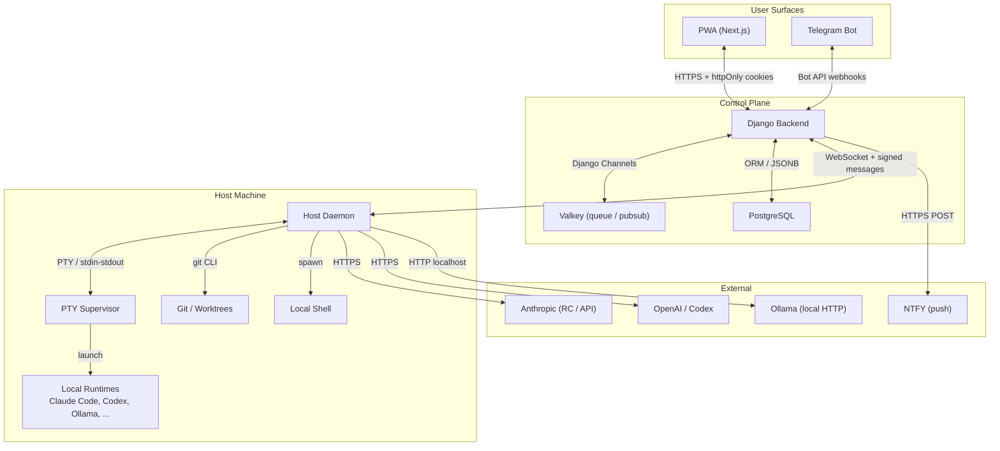
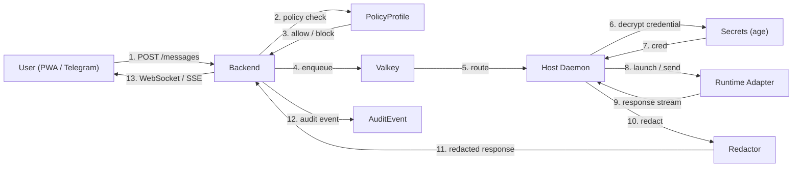
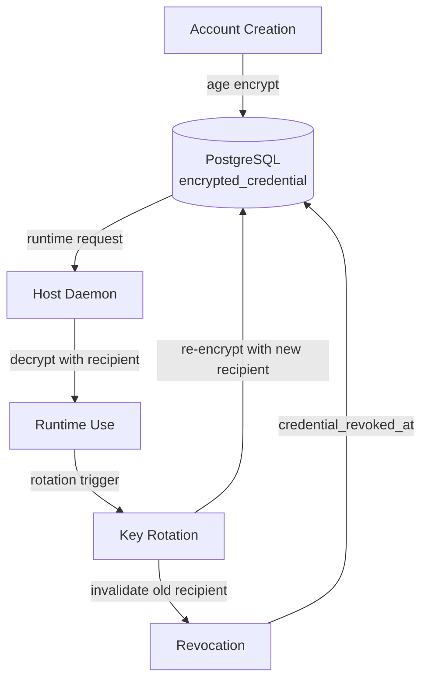
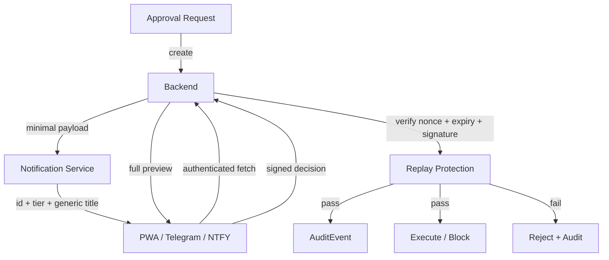
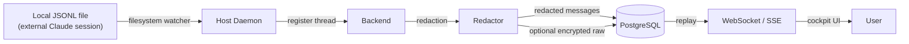

# OpenRemote Control — Threat Model

> Document: T-104a  
> Status: Accepted  
> Blocks: Phase 1 implementation (T-015, T-017, T-070, T-071, T-073, T-086, T-090)

## 1. System Overview

Agent Command Center is an open-source AI-agent command center that lets a user (or team) launch local coding agents, route provider credentials, approve high-risk actions, and observe sessions across multiple hosts. The stack is Django/DRF + Channels (backend), Next.js PWA (frontend), Python asyncio daemon (host agent), PostgreSQL, Valkey, and Celery.

### Context Diagram

---

## 2. Assets

| Asset | Owner | Sensitivity | Where Stored |
|---|---|---|---|
| Provider credentials & OAuth tokens | User | Critical | PostgreSQL (age-encrypted) |
| Host daemon registration tokens | Backend | Critical | PostgreSQL (age-encrypted) |
| Account metadata, org IDs, provider jurisdictions | User / Org | High | PostgreSQL (plaintext metadata) |
| Raw messages | Thread | High | Optional encrypted retention in PostgreSQL |
| Redacted messages | Thread | Medium | PostgreSQL |
| Raw audit events | System | High | Optional encrypted retention in PostgreSQL |
| Redacted audit events | System | Medium | PostgreSQL |
| Approval previews and decisions | System | High | PostgreSQL |
| Project paths, worktree paths, diffs | Project | Medium | PostgreSQL + host filesystem |
| Shell output from runtimes | Thread | High | Optional encrypted retention |
| Local session JSONL files | User | Medium | Host filesystem |
| Telegram bindings and topic mappings | User | Medium | PostgreSQL |
| PWA session cookies & CSRF tokens | Browser | Critical | Browser (httpOnly) + backend session store |
| Age recipient keys | User | Critical | Host filesystem or OS key store |
| Optional OS key store material | User | Critical | macOS Keychain / Windows DPAPI / libsecret |

---

## 3. Trust Boundaries

1. **Browser/PWA to backend** — HTTPS termination, session cookie auth, CSRF protection.
2. **Telegram Bot API to backend** — Webhook with bot token verification.
3. **Backend to PostgreSQL** — Internal network; backend owns the schema and encryption boundaries.
4. **Backend to Valkey** — Internal network; queue and pubsub only, no credential storage.
5. **Backend to host daemon** — WebSocket over Tailscale/WireGuard or local network; signed messages with nonce + expiry + replay protection.
6. **Host daemon to local runtimes and shells** — Same OS user; PTY/stdin-stdout boundary.
7. **Host daemon to local filesystem and worktrees** — Same OS user; no elevated privileges assumed.
8. **Backend or host daemon to cloud model providers** — HTTPS outbound; API keys or OAuth tokens in `Authorization` headers.
9. **Backend to notification transports (NTFY)** — HTTPS outbound; high-entropy authenticated topics.
10. **Observability pipeline** — OpenTelemetry → Loki/Tempo/Prometheus; redaction enforced before export.
11. **Backup and restore path** — Encrypted database dumps + age recipient key backups; no plaintext credential export.

---

## 4. Data-Flow Diagram

### Redaction invariant

Redaction runs **before** ORM persistence, WebSocket replay, queue fan-out, logs, traces, and metrics. Raw content may be stored in an opt-in encrypted envelope with a retention expiry. Logs and metrics MUST use redacted fields only.

---

## 5. Credential Flow

### Decisions

- **Envelope metadata**: `credential_key_id`, `credential_recipient`, `credential_scheme_version`, `credential_rotated_at`, `credential_revoked_at` are mandatory fields.
- **Rotation**: A management command re-encrypts all credentials for a given key ID with a new age recipient. Old recipients are revoked but kept in a recovery registry for disaster recovery.
- **Optional OS key store**: macOS Keychain, Windows DPAPI, and libsecret backends are supported as an alternative to filesystem age recipients.
- **Backup**: Age recipient keys and encrypted credential envelopes are backed up separately. Recipient keys are split across two offline locations. No plaintext credential ever enters backup.

---

## 6. Approval Flow

### Decisions

- **Notification payloads** contain only `approval_id`, `risk_tier`, and a generic title. No command preview or secret material is sent.
- **Full preview** is fetched only inside the authenticated PWA or Telegram surface.
- **Signed decision**: The approval action requires a signed nonce, expiry timestamp, and replay-protection check.
- **One-tap approve** is disabled for destructive actions unless the authenticated UI confirms full context.

---

## 7. Observed Session Flow (JSONL Watcher)

### Decisions

- JSONL files must reside within configured Claude config roots (`~/.claude/` or `CLAUDE_CODE_WORKSPACE`). Files outside these roots cannot register as observed sessions.
- Thread registration requires a host-bound daemon token. Unauthenticated file changes are ignored.
- Raw encrypted retention is opt-in per PolicyProfile and expiry-bound.

---

## 8. Attacker Model

| Attacker | Capability | Target | Mitigation |
|---|---|---|---|
| Remote unauthenticated attacker | Network access to backend or daemon | Auth bypass, DoS | HTTPS + WAF + rate limiting; daemon WebSocket requires signed token |
| Authenticated low-privilege user | Valid session (once multi-user exists) | Elevate privileges, access other users' threads | RBAC on threads/projects/accounts; row-level security on PostgreSQL |
| Compromised browser session / XSS | JavaScript in PWA origin | Read tokens, impersonate user | httpOnly SameSite cookies; no IndexedDB bearer tokens; CSP |
| Compromised Telegram account | Bot API access | Approve actions, read summaries | Signed nonces + expiry; destructive actions require full-context confirmation |
| Compromised host daemon token | Token exfil from host | Impersonate host, steal credentials | Token rotation; replay protection; host-bound scope |
| Malicious or compromised local runtime | Runs on host OS | Escape to shell, read filesystem | PTY sandboxing (`--sandbox` where supported); policy `block_destructive`; worktree isolation |
| Prompt injection via repo files or tool output | Controls LLM input | Hijack agent behavior | Command classifier (T-070); approval gate for destructive actions |
| Malicious dependency or plugin | Supply chain | Code execution in backend or daemon | Pinned lockfiles; `uv` hashes; no `curl | bash` in build; CI reproducibility |
| Network attacker between backend and daemon | Man-in-the-middle | Tamper with messages, replay approvals | Tailscale/WireGuard encryption + daemon signature verification |
| Insider with database read access | PostgreSQL read | Read credentials, raw messages | Age encryption at rest; no plaintext secrets in DB; redaction default |
| Lost laptop with encrypted database backup | Physical access | Offline brute-force of backup | Age passphrase-protected recipients; no plaintext credential export |

---

## 9. STRIDE Threat Inventory

### Spoofing

| Threat | Mitigation |
|---|---|
| Attacker spoofs host daemon to backend | WebSocket token signed with backend secret; host token rotation |
| Attacker spoofs user in PWA via XSS | httpOnly cookies + CSRF tokens + CSP |
| Attacker spoofs Telegram bot to backend | Webhook secret verification; bot token never in client |

### Tampering

| Threat | Mitigation |
|---|---|
| Tamper with approval decision in transit | Signed nonce + expiry + replay protection |
| Tamper with message content in queue | Daemon-to-backend message signatures |
| Tamper with audit events | Append-only partitioned table; checksums on encrypted retention |

### Repudiation

| Threat | Mitigation |
|---|---|
| User denies approving a destructive action | AuditEvent with signed decision payload; nonce linkage |
| Runtime denies executing a command | AuditEvent with command hash and runtime response |

### Information Disclosure

| Threat | Mitigation |
|---|---|
| Database dump exposes credentials | Age encryption at rest; no plaintext secrets |
| Log files contain API keys or tokens | Redaction before logging; structured logs only |
| WebSocket replay leaks raw messages | Redaction before replay; raw encrypted retention opt-in |
| Approval notification leaks command details | Minimal payload (id + tier + title only) |
| XSS reads IndexedDB tokens | No IndexedDB bearer tokens; httpOnly cookies |
| Insider reads raw audit payloads | Redacted default; encrypted raw opt-in with expiry |

### Denial of Service

| Threat | Mitigation |
|---|---|
| Flood backend with thread creation | Rate limiting per user; max parallel threads per PolicyProfile |
| Flood host daemon with runtime launches | Max runtime minutes; daemon cgroup limits (where supported) |
| Exhaust Valkey memory | Celery task result expiry; message TTL |
| Exhaust PostgreSQL disk | Partitioned audit tables; retention policies |

### Elevation of Privilege

| Threat | Mitigation |
|---|---|
| Low-privilege user accesses admin endpoints | Django admin gated behind superuser; API RBAC |
| Runtime escapes PTY to host shell | `--sandbox` where supported; policy `block_destructive`; worktree isolation |
| Compromised backend worker accesses secrets | Secrets decrypted only in daemon; backend never holds plaintext |
| Malicious skill executes unauthorized runtime | Skill → Account → PolicyProfile chain; deny-by-default |

---

## 10. Required Security Decisions (Accepted)

| Decision | Rationale |
|---|---|
| Cookie/session strategy for PWA | httpOnly SameSite cookies with CSRF protection. No persistent bearer tokens in client storage. |
| CSRF enforcement | Double-submit cookie pattern on all state-changing mutations. |
| Host daemon authentication | Per-host registration token with rotation, nonce verification, and replay protection. |
| Credential envelope metadata | `credential_key_id`, `credential_recipient`, `credential_scheme_version`, `credential_rotated_at`, `credential_revoked_at` tracked for rotation and recovery. |
| Optional OS key store | Supported backends: macOS Keychain, Windows DPAPI, libsecret. Falls back to filesystem age recipients. |
| Redaction-before-persistence | Default invariant. Redaction runs before ORM save, WebSocket replay, queue fan-out, logs, traces, and metrics. |
| Raw encrypted retention policy | Opt-in per PolicyProfile. Expiry enforced by Celery cleanup task. |
| Default policy profiles | Deny-by-default. Confidential and regulated profiles deny cloud models, RC-via-Anthropic, and unknown jurisdictions. |
| RC-via-Anthropic treatment | Provider-routed remote access, not local-only execution. Requires explicit `rc_via_anthropic_allowed` in policy. |
| NTFY and Telegram approval payloads | Minimal: approval id, risk tier, generic title. Full preview fetched only inside authenticated surface. |
| Destructive-action confirmation policy | Blocked by default. Require explicit authenticated approval with full context. |
| Observability redaction | Logs, traces, and metrics use redacted fields only. No raw secrets in Loki/Tempo/Prometheus. |

---

## 11. Phase-by-Phase Security Gates

| Phase | Security-Sensitive Tasks | Gate |
|---|---|---|
| Phase 0 (this document) | T-104a, T-104b, T-104c | **Accepted before any Phase 1 code** |
| Phase 1 | T-015 credential vault, T-017 auth, T-042 Ollama isolation | Design review before implementation; security review before merge |
| Phase 1 | T-070 command classifier, T-071 approval flow | Design review before implementation; security review before merge |
| Phase 1 | T-073 redaction, T-081 frontend auth | Design review before implementation; security review before merge |
| Phase 1 | T-086 approval push actions | Design review before implementation; security review before merge |
| Phase 1 | T-090 observability | Security review before merge |

---

## 12. Acceptance Tests (Must Be Defined Before Implementation)

- [ ] XSS cannot read control-plane bearer credentials.
- [ ] CSRF-protected mutation endpoints reject missing or invalid tokens.
- [ ] Host daemon messages reject stale nonce or replayed signatures.
- [ ] Credential rotation preserves account usability and invalidates old recipients.
- [ ] Redaction runs before ORM persistence, WebSocket replay, queue publication, logs, and traces.
- [ ] Raw encrypted content expires according to PolicyProfile retention.
- [ ] Confidential projects reject cloud models, RC-via-Anthropic, and unknown jurisdictions by default.
- [ ] Approval notification payloads leak no command preview or secret material.
- [ ] Approval decisions cannot be replayed after expiry.
- [ ] Destructive shell commands are blocked or require explicit authenticated approval.
- [ ] Observed JSONL sessions cannot register outside configured Claude config roots.
- [ ] Backup restore does not expose plaintext credentials.
